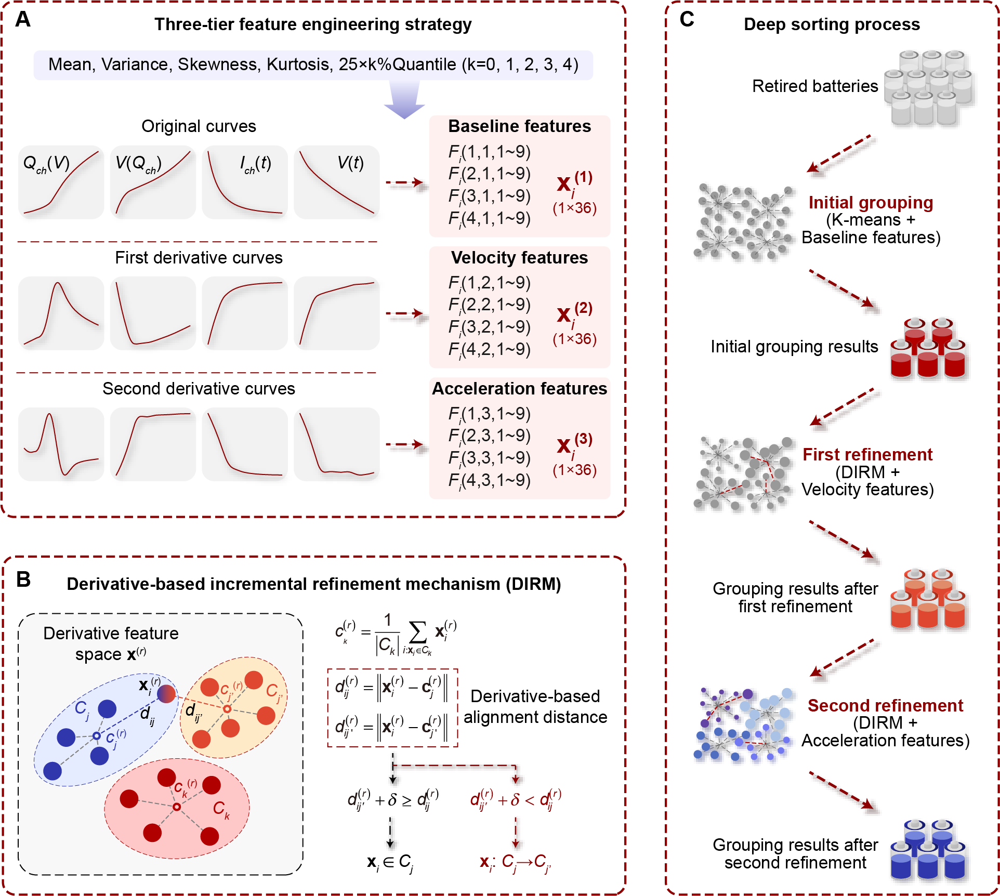

# 🚀 Code for: Deep sorting of reused batteries for enabling long-term consistency grouping with unknown prior conditions

---

## 📝 Abstract
When reusing lithium-ion batteries retired from electric vehicles, the main challenge lies in accurately grouping cells to ensure stable, long-term consistency, especially given their unknown usage histories and heterogeneous aging pathways. Here, we propose a deep sorting framework that leverages implicit features derived from a single charge cycle, achieving improved performance compared to conventional explicit feature-based methods. Our method extracts 108 implicit features from characteristic curves and their derivatives, followed by a two-step refinement based on derivative features. This strategy extends usable service life by 30% and reduces aging differences by 40% compared to state-of-the-art methods, highlighting the broader potential of implicit feature-based decision-making in complex systems.

## 📚 Introduction
With the increasing retirement of electric vehicle batteries, **effective second-life utilization** has become critical. Traditional sorting methods mainly rely on **explicit features** such as capacity and internal resistance. However, these features often fail to predict the batteries' long-term aging behavior accurately.

This project proposes a **deep sorting strategy** combining:

- **Feature Engineering**: Extract 108 implicit features based on characteristic curves (voltage–capacity, current–time, voltage–time curves) and their first- and second-order derivatives.
- **Deep Sorting Framework**: Perform two-step sorting — first grouping by baseline features, then refining by higher-order derivative features to achieve superior consistency.



## 🏗️ Project Structure
```
├── Feature_engineering
│   ├── 1_cycle_data_extraction.py         # Extract 1-cycle characteristic curves
│   ├── 2_feature_extraction.py            # Generate 108 implicit features
│   ├── 3_capa_trajectory_extraction.py    # Extract capacity trajectory during second life
│   └── dataset/                           # Processed dataset
├── Deep_sorting_framework
│   ├── main.py                            # Perform deep sorting
│   ├── metrics.py                         # Computes evaluation metrics
│   ├── model.py                           # Deep sorting implementation
│   └── metrics/
│       └── load_metrics.py                # Load and visualize saved metrics
└── Deep_sorting_framework.tif             # Framework diagram
```

## ⚙️ Requirements
- Python 3.8
- numpy==1.21.5
- scikit-learn==1.0.2

Install dependencies:
```bash
pip install numpy==1.21.5 scikit-learn==1.0.2
```

## 🚀 Usage Instructions

### 1. Download Dataset
Download the raw dataset from Zenodo and extract to the project root:
```bash
https://doi.org/10.5281/zenodo.14859405
```

### 2. Feature Engineering
```bash
cd Feature_engineering
python 1_cycle_data_extraction.py
python 2_feature_extraction.py
python 3_capa_trajectory_extraction.py
```
Processed files are saved under `Feature_engineering/dataset/`.

### 3. Deep Sorting
```bash
cd ../Deep_sorting_framework
python main.py
```
Metrics are computed and saved automatically.

To load and view the results:
```bash
cd metrics
python load_metrics.py
```

## 📄 Citation
If you use this code, please cite:

> Wang, S., Gao, F., Tian, H.  
> *Deep sorting of reused batteries for enabling long-term consistency grouping with unknown prior conditions*.  
> Cell Reports Physical Science (2025). DOI: (to be updated)

## 📬 Contact
For any questions, contact: **wshuquan@mail.sdu.edu.cn**
